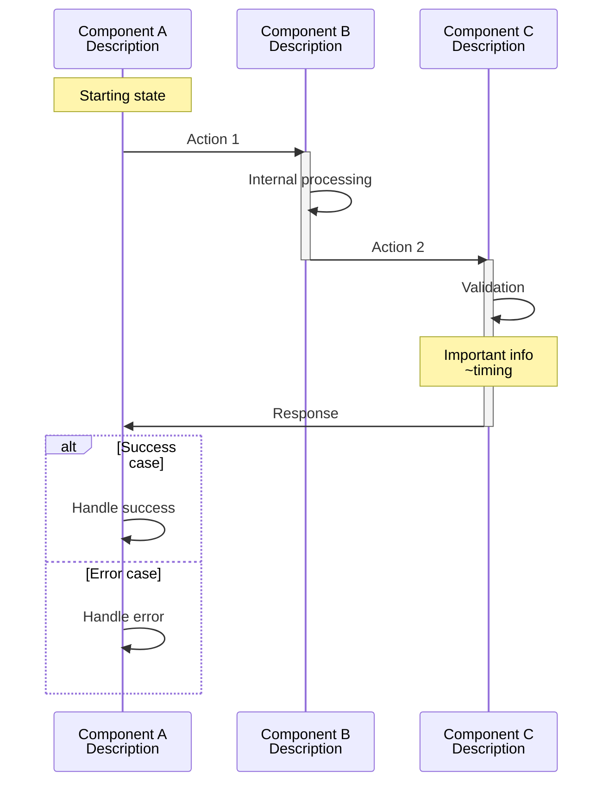
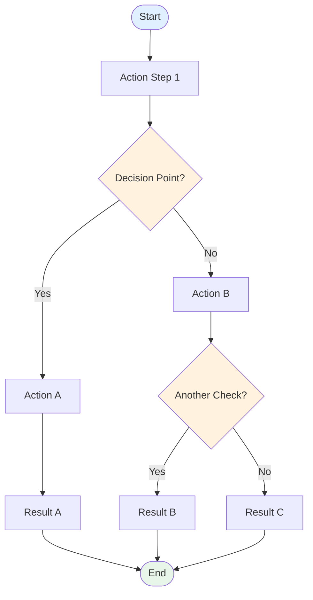
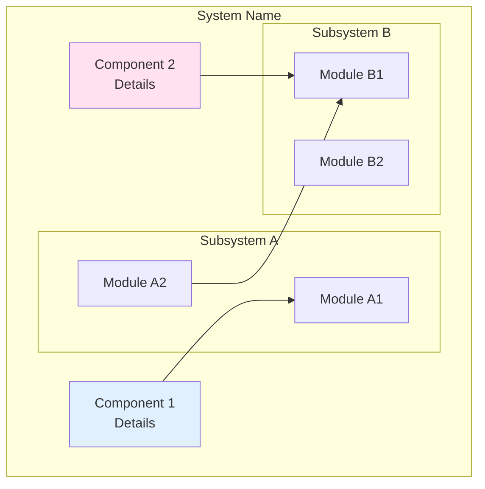

@ -1,943 +0,0 @@
# Documentation & Diagram Prompts Library

**Type**: Claude Code Slash Command
**Usage**: `/v.docdiagrams <type>` or `/v.docdiagrams all` to make all
**Version**: 1.1
**Last Updated**: 2025-10-18

---

## 🚀 Purpose

This file provides reusable prompt templates for documentation diagrams. 
Required Diagram Types:

1. **Overall System Architecture** (graph TB)
   - Show all major components and their relationships
   - Include external data sources
   - Show data flow between components
   - Group related components in subgraphs (servers, files, processes)
   - Use color coding by component type

2. **Data Flow Pipeline** (sequenceDiagram)
   - Show complete end-to-end data flow
   - Include all participants (admins, servers, external APIs, traffic)
   - Show timing information (~Xs)
   - Include decision branches (alt/else)
   - Add notes for critical steps

3. **Main Process Workflows** (flowchart TD) - One per major script
   - Show complete decision logic from start to end
   - Include all conditional branches
   - Show error handling paths
   - Use appropriate node shapes (diamond for decisions, rectangle for actions)
   - Color code by operation type

4. **Rule/Logic Evaluation** (graph TD) - If applicable
   - Show sequential evaluation logic
   - Highlight priority levels
   - Show accept/reject decisions
   - Use color coding for different outcomes

5. **Algorithm Details** (flowchart TD) - For complex algorithms
   - Show step-by-step algorithm execution
   - Include loop structures
   - Show data transformations
   - Add complexity notation (O(n), O(n log n))

6. **Timeline Diagrams** (gantt) - For time-sensitive processes
   - Show process duration breakdown
   - Highlight critical phases
   - Mark milestones
   - Include timing annotations

7. **System Integration** (graph TB)
   - Show how all components work together
   - Include cron schedules
   - Show on-demand vs scheduled operations
   - Include data flow arrows

8. **State Transitions** (stateDiagram-v2)
   - Show system states (idle, updating, error, active)
   - Show state transition triggers
   - Include recovery paths
   - Add notes for important states

Document Structure:
- Table of Contents with anchor links
- Each diagram in its own section with descriptive header
- Explanatory text before each diagram
- Legend explaining all colors and symbols
- Changelog section at bottom
- Version number and last updated date

Color Scheme Guidelines:
- Use consistent colors across all diagrams
- Document color meanings in legend
- Use hex codes for precision (#e1f5ff, #ffe1e1, etc.)
- Reserve red for errors/critical, green for success, yellow for warnings

Requirements:
- All diagrams must be GitHub Mermaid compatible
- Follow the Golden Rule: standalone nodes before child subgraphs
- Include descriptive node text with line breaks (<br/>)
- Keep node text under 50 characters per line
- Add style definitions for visual clarity
- Test all diagrams render on GitHub

Context:
- Project: [PROJECT_NAME]
- Purpose: [WHAT_SYSTEM_DOES]
- Key workflows: [LIST_MAIN_WORKFLOWS]
- Critical components: [LIST_CRITICAL_PARTS]
- Deployment model: [CENTRALIZED/DISTRIBUTED/etc]

---

## 📋 Quick Reference for <type>

| Shortcut | Purpose | Use When |
|----------|---------|----------|
| `all` | Create comprehensive architecture diagram doc | New codebase or major system documentation |
| `arch` | Add feature to architecture diagram | New component/integration added |
| `sequence` | Create sequence diagram for data flow | Documenting process flow between components |
| `flowchart` | Create flowchart for workflow | Documenting decision logic/state transitions |
| `decision` | Document architectural decision | After making significant technical choice |
| `lesson` | Add lesson learned | Discovered important gotcha/best practice |

---

Check all Mermaid diagrams in @docs/DIAGRAMs.md for GitHub compatibility issues.

Validation Checklist:
1. ✅ All standalone nodes declared BEFORE child subgraphs within parent subgraphs
2. ✅ No nodes placed between child subgraphs
3. ✅ No nodes placed after child subgraphs
4. ✅ Proper syntax for all diagram types (graph TD, sequenceDiagram, flowchart TD)
5. ✅ All node IDs are unique within diagram
6. ✅ All referenced node IDs are declared
7. ✅ All arrows use valid syntax (-->, ->>)
8. ✅ Style definitions reference existing nodes
9. ✅ Subgraph syntax follows GitHub rules
10. ✅ No consecutive blank subgraphs

Common Issues to Fix:
- Move standalone nodes to beginning of parent subgraph
- Remove mixing of nodes and subgraphs
- Fix undefined node references
- Correct arrow syntax
- Remove duplicate node IDs

Requirements:
- Check all diagrams in the file (currently 11 diagrams)
- Test rendering on GitHub (not just local editor)
- Document any issues found
- Provide specific line numbers and fix recommendations


## 🎯 Prompt Templates

### `all` - Create Comprehensive Architecture Diagram Documentation

**Alias**: `all`

**Full Prompt**:
```
Create a comprehensive architecture diagram documentation file at @docs/DIAGRAMs.md for the [PROJECT_NAME] codebase.

Analyze the key components of the project and create diagrams for all the possible types:
`arch` , `sequence`, `flowchart`, `decision`, `lesson`


```
**Example Usage**:
```
Create a comprehensive architecture diagram documentation file at @docs/DIAGRAMs.md for the Firewall Security Management codebase.

Analyze the following components and create diagrams:
- Main code files (java, go, js, ts, py, php, c, cs, html ...): ...
- Shell scripts: ...
- Config files: ...
- Data files: ...

Required Diagram Types:

1. **Overall System Architecture** (graph TB)
   - External sources: Tor API, Firehol, GitHub API, Akamai
   - Central server: xxx
   - Remote servers: 30+ streaming video servers
   - Data flow: External → Central → Remote → Active Firewall
   - Color code: Blue (central), Yellow (remote), Purple (processing), Red (Docker)

2. **Data Flow Pipeline** (sequenceDiagram)
   - Participants: Sysadmin, Central, External APIs, Remote, Network Traffic
   - Daily data prep at 23:30
   - 5-minute whitelist sync
   - On-demand import process
   - Packet evaluation flow

3. **Main Process Workflows** (flowchart TD):
   - Script A: Complete flow from root check → script update → checksum compare → ipset swap → iptables reload → Docker recovery
   - script B: Merge sources → extract WAF → overlap detection → generate files

4. **Rule Evaluation Logic** (graph TD)
   - Sequential rule evaluation from loopback → invalid → blacklist → whitelist → tor → firehol → established → default drop
   - Show priority levels with color coding
   - Highlight manual blacklist as highest priority

5. **XYZ code Overlap Detection Algorithm** (flowchart TD)
   - Read input → Parse networks → Sort by start IP → Loop and check containment → Write output
   - Include O(n log n) complexity notation
   - Show example with 10.0.0.0/8 containing 10.42.1.0/24

6. **Docker Recovery Timeline** (gantt)
   - 15-second process breakdown
   - Phases: Preparation (0-7s), Critical (7-13s), Recovery (13-19s)
   - Mark container disconnection/reconnection milestones

7. **Complete System Integration** (graph TB)
   - Cron schedules (daily 23:30, every 5min)
   - Manual admin actions
   - Data preparation → import → enforcement
   - Show timing for each stage

8. **System State Transitions** (stateDiagram-v2)
   - States: Fresh_Install → No_Rules → Emergency_Restore → Rules_Active → Checking → Updating → Docker_Recovery
   - Emergency restoration path for network failures
   - Post-reboot auto-detection

Color Scheme:
- Blue (#e1f5ff): Central server processes
- Yellow (#fff4e1): Remote server processes
- Purple (#f0e1ff): Python/processing
- Red (#ffe1e1): Docker operations
- Pink (#ffe1f0): WAF operations
- Green (#99ff99): Success/accept
- Orange (#ffcc99): Warnings

Context:
- Project: Security Infrastructure Management System
- Purpose: Centralized firewall management for 30+ streaming video servers
- Key workflows: Daily data prep, 5-min whitelist sync, on-demand import, Docker recovery
- Critical components: Atomic ipset swaps (zero-downtime), overlap detection, Docker awareness
- Deployment model: Centralized data preparation, distributed enforcement
```

---

### `arch` - Add Feature to Architecture Diagram

**Alias**: `arch`

**Full Prompt**:
```
Update @docs/DIAGRAMs.md to document the [FEATURE_NAME] integration.

Requirements:
1. Update the Overall System Architecture diagram to show [COMPONENT_NAME] and data flow
2. Add a sequence diagram in the Data Flow Pipeline section showing the [PROCESS_NAME] process
3. Add a flowchart in the [RELEVANT_SECTION] section showing [WORKFLOW_NAME] decision logic
4. Use [COLOR] color coding (#HEXCODE) for [FEATURE_NAME]-related operations
5. Update the Legend section with the new color
6. Update the version number and add a changelog entry
7. Ensure all diagrams are compatible with GitHub's Mermaid parser (standalone nodes before child subgraphs)

Context:
- [FEATURE_NAME] does [WHAT_IT_DOES]
- Located in [FILE_PATH]
- Integrates with [OTHER_COMPONENTS]
- Produces [OUTPUT_FILES] (~X entries)


---

### `sequence` - Create Sequence Diagram for Data Flow

**Alias**: `sequence`

**Full Prompt**:
```
Add a Mermaid sequence diagram to @docs/DIAGRAMs.md showing the [PROCESS_NAME] data flow.

Participants:
- [COMPONENT_1]: [DESCRIPTION]
- [COMPONENT_2]: [DESCRIPTION]
- [COMPONENT_3]: [DESCRIPTION]

Flow:
1. [COMPONENT_1] → [COMPONENT_2]: [ACTION_DESCRIPTION]
2. [COMPONENT_2] → [COMPONENT_2]: [INTERNAL_PROCESSING]
3. [COMPONENT_2] → [COMPONENT_3]: [DATA_TRANSFER]
4. [COMPONENT_3] → [COMPONENT_3]: [VALIDATION]
5. Note over [COMPONENT]: [IMPORTANT_INFO]

Requirements:
- Place in section [SECTION_NUMBER] after [PREVIOUS_DIAGRAM]
- Use clear action descriptions with timing info (~Xs)
- Include error handling paths if applicable
- Add notes for critical steps
- Test GitHub rendering compatibility


---

### `flowchart` - Create Flowchart for Workflow

**Alias**: `flowchart`

**Full Prompt**:
```
Add a Mermaid flowchart to @docs/DIAGRAMs.md showing the [WORKFLOW_NAME] decision logic.

Flow Structure:
START → [STEP_1] → [DECISION_1]{Condition?}
  → YES: [ACTION_A] → [RESULT_A]
  → NO: [DECISION_2]{Another condition?}
    → YES: [ACTION_B] → [RESULT_B]
    → NO: [ACTION_C] → [RESULT_C]

Styling:
- [COLOR_1] (#HEXCODE): [CATEGORY_1] operations
- [COLOR_2] (#HEXCODE): [CATEGORY_2] operations
- [COLOR_3] (#HEXCODE): [CATEGORY_3] operations

Requirements:
- Place in section [SECTION_NUMBER]
- Use diamond shapes for decisions
- Use rectangle shapes for actions
- Apply color styling consistently
- Keep node text concise (<50 chars per line)
- Follow GitHub Mermaid compatibility rules


---

### `decision` - Document Architectural Decision

**Alias**: `decision`

**Full Prompt**:
```
Add an architectural decision entry to @memory/progress.md in the "Recent Decisions Log" section.

Decision Details:
- **Title**: [DECISION_TITLE] ([DATE])
- **Version**: [AFFECTED_FILES] v[VERSION]
- **Why**: [PROBLEM_STATEMENT]
- **What**: [SOLUTION_DESCRIPTION]
- **Impact**: [MEASURABLE_RESULTS]
- **Files**: [MODIFIED_FILES]

Template:
### [DECISION_TITLE] (YYYY-MM-DD)
**Version**: [files] v[version]

**Why**: [Explain the problem that required this decision]

**What**: [Describe the solution/approach chosen]
  - Key feature 1
  - Key feature 2
  - Critical consideration

**Impact**:
- ✅ Positive outcome 1
- ✅ Positive outcome 2
- ✅ Metrics if applicable

**Files**: [list of modified files]

Requirements:
- Insert chronologically at the top of "Recent Decisions Log"
- Use clear, concise language
- Include version numbers
- Quantify impact where possible
- Update "Last Updated" date at top of progress.md
```

**Example Usage**:
```
Add an architectural decision entry to @memory/progress.md in the "Recent Decisions Log" section.

Decision Details:
- **Title**: WAF Auto-Ban Integration - FIXED
- **Version**: syncWhitelist.sh v1.6.7
- **Why**: Align automated WAF bans with managed blacklist so import scripts deploy them without manual copying
- **What**: Parse nginx ban file, extract valid IPs, merge with manual blacklist using AWK
- **Impact**: ~1,086 WAF IPs automatically added to firewall blacklist
- **Files**: syncWhitelist.sh v1.6.7

Template:
### WAF Auto-Ban Integration - FIXED (2025-10-17)
**Version**: syncWhitelist.sh v1.6.7

**Why**: Align automated WAF bans with the managed blacklist so import scripts deploy them without manual copying.

**What**: Automatic extraction and merging of nginx WAF-banned IPs into the firewall blacklist
  - Parse /etc/nginx/banned_ips.conf
  - Extract valid IPv4 addresses using AWK
  - Merge with manual blacklist.txt

**Impact**:
- ✅ ~1,086 WAF IPs successfully extracted and merged into blacklist_generated.lst
- ✅ Total blacklist: ~1,224 entries (138 manual + 1,086 WAF)
- ✅ Compatible with GNU Awk 3.1.7 (CentOS 6) and modern AWK versions

**Files**: syncWhitelist.sh v1.6.7
```

---

### `lesson` - Add Lesson Learned

**Alias**: `lesson`

**Full Prompt**:
```
Add a lesson learned to @memory/progress.md in the "Key Lessons Learned" section.

Lesson Details:
- **Number**: [NEXT_SEQUENTIAL_NUMBER]
- **Title**: [CONCISE_TITLE]
- **Severity**: [CRITICAL/WARNING/INFO]
- **Problem**: [WHAT_WENT_WRONG]
- **Solution**: [HOW_TO_AVOID]
- **Example**: [CODE_OR_SCENARIO]

Template:
[NUMBER]. **[TITLE]** ⚠️ [SEVERITY_IF_CRITICAL]
   - [Brief explanation of the problem]
   - [Why it happens]
   - [How to detect it]
   - [Solution/prevention]

   **Example Pattern**:
   - ❌ BAD: [Anti-pattern with explanation]
   - ✅ GOOD: [Correct pattern with explanation]

Requirements:
- Add to "Key Lessons Learned" section
- Number sequentially
- Use ⚠️ emoji for CRITICAL items
- Include code examples where applicable
- Make it actionable (clear do's and don'ts)
```

**Example Usage**:
```
Add a lesson learned to @memory/progress.md in the "Key Lessons Learned" section.

Lesson Details:
- **Number**: 7
- **Title**: GitHub Mermaid Parser Compatibility
- **Severity**: CRITICAL
- **Problem**: GitHub's Mermaid parser cannot handle standalone nodes placed after child subgraphs
- **Solution**: Declare ALL standalone nodes BEFORE any child subgraphs within a parent
- **Example**: Proper node ordering in subgraphs

Template:
7. **GitHub Mermaid Parser Compatibility** ⚠️ CRITICAL
   - GitHub's Mermaid parser is STRICTER than other renderers (mermaid.live, VSCode)

   **The Golden Rule**: Within a parent subgraph, declare ALL standalone nodes BEFORE any child subgraphs

   - ❌ BAD Pattern (causes "Lexical error - Unrecognized text"):
     ```
     subgraph "Parent"
         NODE1[...]
         subgraph "Child A" ... end
         NODE2[...]                     ❌ Node after subgraph
         subgraph "Child B" ... end
     end
     ```

   - ✅ GOOD Pattern - ALL standalone nodes first, THEN all child subgraphs:
     ```
     subgraph "Parent"
         NODE1[...]                     ✅ All nodes first
         NODE2[...]

         subgraph "Child A" ... end     ✅ All subgraphs after
         subgraph "Child B" ... end
     end
     ```

   - **Why**: GitHub parser cannot handle mixed ordering of nodes and subgraphs
   - **Testing**: Always verify diagrams render on GitHub, not just in local editors
```

---

## 🎨 Mermaid Diagram Templates

### Sequence Diagram Template



### Flowchart Template



### System Architecture Template



---

## 🔧 GitHub Mermaid Compatibility Rules

### ✅ DO

1. **Declare all standalone nodes before child subgraphs**
   ```mermaid
   subgraph "Parent"
       NODE1[...]
       NODE2[...]

       subgraph "Child A" ... end
       subgraph "Child B" ... end
   end
   ```

2. **Use consistent arrow syntax**
   - Flowchart: `-->` (solid), `-.->` (dotted), `==>` (thick)
   - Sequence: `->>` (solid), `-->>` (dotted)

3. **Keep node text concise**
   - Use `<br/>` for line breaks
   - Max ~50 characters per line
   - Avoid special characters in node IDs

4. **Test on GitHub**
   - Local editors may be more forgiving
   - Always verify rendering on actual GitHub

### ❌ DON'T

1. **Don't mix nodes and subgraphs**
   ```mermaid
   subgraph "Parent"
       NODE1[...]
       subgraph "Child A" ... end
       NODE2[...]  ❌ Don't put nodes after subgraphs
   end
   ```

2. **Don't use undefined node IDs**
   ```mermaid
   NODE1 --> NODE2  ❌ NODE2 not declared
   ```

3. **Don't create duplicate node IDs**
   ```mermaid
   NODE1[First]
   NODE1[Second]  ❌ Duplicate ID
   ```

4. **Don't assume local renderer = GitHub**
   - GitHub parser is stricter
   - VSCode/mermaid.live may accept invalid syntax


---

## 🔄 Maintenance

**When to Update This File**:
- New diagram pattern discovered
- New documentation pattern emerges
- GitHub Mermaid rules change
- User feedback on prompt effectiveness

**Version History**:
- v1.1 (2025-10-18): Added `add-diagrams` prompt for comprehensive architecture documentation
- v1.0 (2025-10-18): Initial creation with WAF documentation patterns

---

**Maintainer Note**: Keep this file in sync with actual documentation practices. Update templates when patterns evolve.